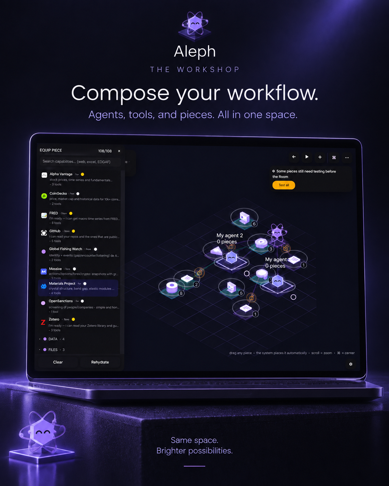
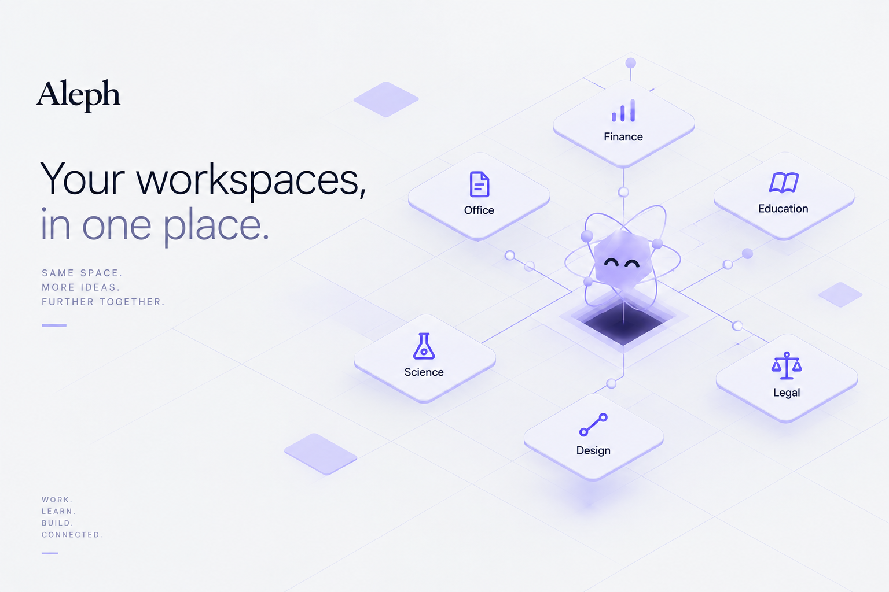
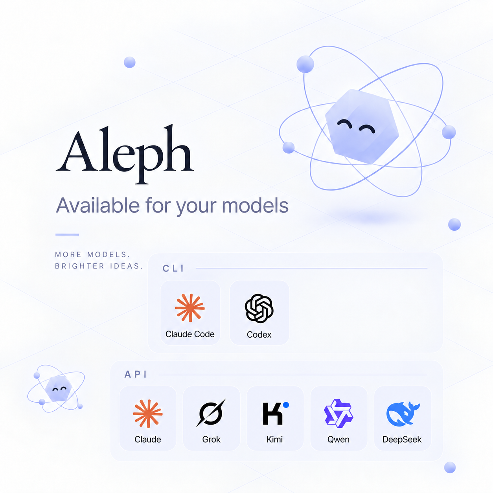
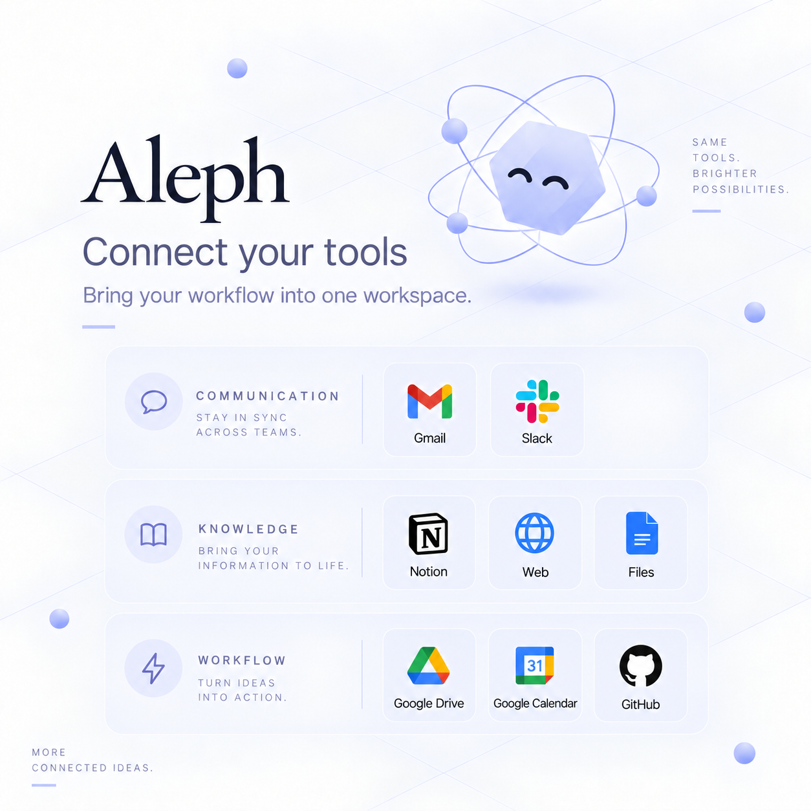

# Aleph

**One space. Infinite work.**

Aleph is a desktop work environment for coordinating models, tools, structured workspaces, artifacts, and local capabilities through a shared application shell.

This repository is intended to be the **technical distribution and documentation surface** for Aleph. Depending on the release, it may contain documentation, screenshots, checksums, packaged releases, and public technical material. Do not infer source-code availability or licensing terms from the presence of this repository alone.

> Current release target: **macOS**. Aleph was built first for macOS, with a broader cross-platform future in mind.

## Aleph 0.1.0 for macOS

The first Aleph binary release is available for macOS. Windows and Linux are planned, not available in version 0.1.0. Aleph application source remains private and proprietary; independently licensed third-party components retain their own terms.

- [Website](https://aleph-site-jade.vercel.app/)
-  [Download for macOS](https://aleph-site-jade.vercel.app/download/mac) (DMG, 2,325,636,024 bytes)
- [Documentation and installation instructions](https://aleph-site-jade.vercel.app/docs/installation/)
- [Release index and SHA-256](docs/RELEASES.md)
- [SHA256SUMS](SHA256SUMS)

SHA-256 of `Aleph-macOS.dmg`: `ee42680234bca202fe8f954b9f75d29b4f6e13b7f74f70a38068683c3b9dec72`.

This macOS app is ad-hoc signed and is not notarized. Gatekeeper may warn or block its first opening; verify the downloaded DMG checksum, then follow the [manual-opening instructions](https://aleph-site-jade.vercel.app/docs/installation/). The DMG is hosted on Cloudflare R2, not in this repository.



## What Aleph is

Aleph is organized around four ideas:

1. **A common shell** — navigation, sessions, model/tool selection, artifacts, and workspace entry points share one product frame.
2. **Specialized workspaces** — Science, Education, Office, Finance, Legal, and Design expose domain-specific workflows without fragmenting the application into unrelated products.
3. **Interchangeable model and tool layers** — model APIs, CLI coding agents, connectors, browser/file tooling, and local execution can be surfaced through the same product architecture.
4. **The Workshop** — a composition surface for arranging agents, tools, and reusable pieces into a working system rather than treating each capability as an isolated chat.

Aleph is not designed around a single model. A model is one component in a larger runtime that includes orchestration, permissions, artifacts, local execution, browser/network boundaries, and workspace-specific interfaces.

## Product surfaces

### The Workshop

The Workshop is the composition layer for agents, tools, and pieces. It is the current product name for the surface previously referred to internally as "The Room".

### Workspaces

Aleph currently organizes domain workflows into six primary workspaces:

- **Science** — research, evidence, structured scientific artifacts, code-assisted analysis, and scientific files.
- **Education** — study workflows, explanations, exercises, learning artifacts, and structured academic work.
- **Office** — documents, spreadsheets, presentations, tables, files, and productivity workflows.
- **Finance** — analysis, market data, backtests, run reports, charts, metrics, and finance-specific tooling.
- **Legal** — matters, documents, structured review, workflows, and legal-domain organization.
- **Design** — visual work, iterative design changes, generated assets, and creative tooling.



See [`docs/WORKSPACES.md`](docs/WORKSPACES.md) for the developer-facing workspace model.

## Runtime model

At a high level, Aleph separates the system into several security and runtime boundaries:

```text
Desktop shell
    |
    +-- Shared Aleph workspace shell
    |     +-- The Workshop
    |     +-- Science
    |     +-- Education
    |     +-- Office
    |     +-- Finance
    |     +-- Legal
    |     +-- Design
    |
    +-- Local application/backend sidecars
    |     +-- session + workspace APIs
    |     +-- artifacts/files
    |     +-- OAuth/connectors
    |     +-- browser mediation
    |     +-- local tool dispatch
    |
    +-- Isolated execution boundary
    |     +-- Python / shell guest execution
    |
    +-- External capability layer
          +-- model providers
          +-- coding CLIs
          +-- web services
          +-- user-authorized connectors
```

The exact implementation changes across releases. The internal source tree is generally divided across `product/`, `platform/`, `deploy/`, and selected packaged third-party components.

For a deeper technical map, see [`docs/ARCHITECTURE.md`](docs/ARCHITECTURE.md).

## Models and tools

Aleph can expose multiple model/tool paths instead of binding the product to one provider. Release-specific availability can include API-backed models, locally managed credentials, and CLI-based coding agents.



Connector and provider availability is **build/configuration dependent**. The UI may show integrations that require installation, authentication, a local CLI, or a user-supplied credential before they become active.

See [`docs/INTEGRATIONS.md`](docs/INTEGRATIONS.md).

## Connectors

Connectors bring external services into Aleph's workflows. Their purpose is not simply account linking: a connector becomes a capability that can be used by the workspace/runtime when the user authorizes it.



Aleph should treat connector credentials, redirect flows, custom provider URLs, browser traffic, and local sidecars as explicit security boundaries rather than ordinary UI state.

## Local capabilities and artifacts

Local capabilities are dispatched through application sidecars and explicit operating-system boundaries. Depending on the build configuration, they can include local tool dispatch, filesystem and artifact handling, browser mediation, and isolated Python/shell guest execution. Their availability is release- and configuration-dependent; they should be permissioned and observable rather than assumed to be ambient host access.

Artifacts are durable outputs that outlive an individual model response: documents, spreadsheets, charts, datasets, generated files, code results, structured domain objects, and previews. Artifact rendering and file access are security-relevant boundaries, not ordinary chat output.

## Repository map

This documentation pack assumes a repository layout like:

```text
.
├── README.md
├── CONTRIBUTING.md
├── SECURITY.md
├── PRIVACY.md
├── assets/
│   ├── hero/
│   ├── overview/
│   ├── workspaces/
│   └── reference/
├── docs/
│   ├── ARCHITECTURE.md
│   ├── DEVELOPMENT.md
│   ├── GETTING_STARTED.md
│   ├── INTEGRATIONS.md
│   ├── PRODUCT_SURFACES.md
│   ├── RELEASE.md
│   ├── SECURITY_MODEL.md
│   ├── TROUBLESHOOTING.md
│   └── WORKSPACES.md
└── .github/
    ├── PULL_REQUEST_TEMPLATE.md
    └── ISSUE_TEMPLATE/
```

A release repository can remain lightweight: documentation and curated media belong here; large internal build outputs, local databases, caches, user state, credentials, browser profiles, or development histories do not.

## Getting started

For product usage, see [`docs/GETTING_STARTED.md`](docs/GETTING_STARTED.md).

For internal development, see [`docs/DEVELOPMENT.md`](docs/DEVELOPMENT.md).

For the release pipeline and validation gates, see [`docs/RELEASE.md`](docs/RELEASE.md).

## Security model

Aleph crosses several high-risk boundaries: web content, loopback services, OAuth, filesystem access, local processes, browser automation, user-supplied connector endpoints, and isolated code execution. These boundaries should be reviewed independently rather than being treated as one trust zone.

The technical security model and expected validation gates are documented in [`docs/SECURITY_MODEL.md`](docs/SECURITY_MODEL.md).

Security reports should follow [`SECURITY.md`](SECURITY.md).

## Development

Internal contributors should prefer small, reviewable changes, preserve established workspace boundaries, and validate the actual packaged application rather than relying only on source-level tests.

## Documentation index

| Document | Purpose |
| --- | --- |
| [`GETTING_STARTED.md`](docs/GETTING_STARTED.md) | Product usage and operating model |
| [`ARCHITECTURE.md`](docs/ARCHITECTURE.md) | Runtime, process, and trust-boundary architecture |
| [`WORKSPACES.md`](docs/WORKSPACES.md) | Workspace contract and domain surfaces |
| [`INTEGRATIONS.md`](docs/INTEGRATIONS.md) | Models, CLI agents, connectors, and credentials |
| [`DEVELOPMENT.md`](docs/DEVELOPMENT.md) | Internal development workflow |
| [`SECURITY_MODEL.md`](docs/SECURITY_MODEL.md) | Security boundaries and validation principles |
| [`RELEASE.md`](docs/RELEASE.md) | Build, validation, packaging, and release gates |
| [`PRODUCT_SURFACES.md`](docs/PRODUCT_SURFACES.md) | Screenshot index and UI references |
| [`TROUBLESHOOTING.md`](docs/TROUBLESHOOTING.md) | Common development/release failures |

## Naming note

Current public/product terminology uses **The Workshop**. Older internal screenshots can still contain the label **The Room**; those images are retained only as historical UI references and should not be used as the canonical product name in new documentation.
