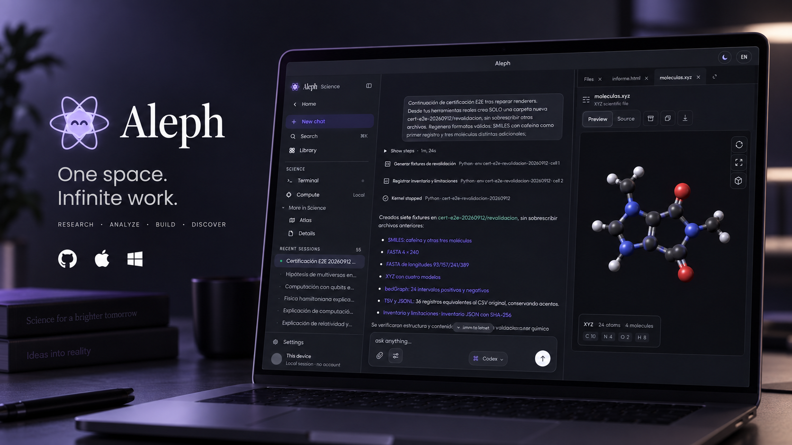
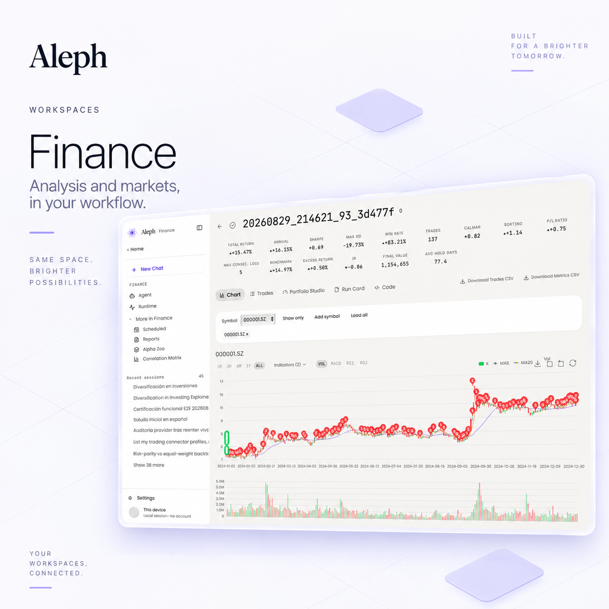
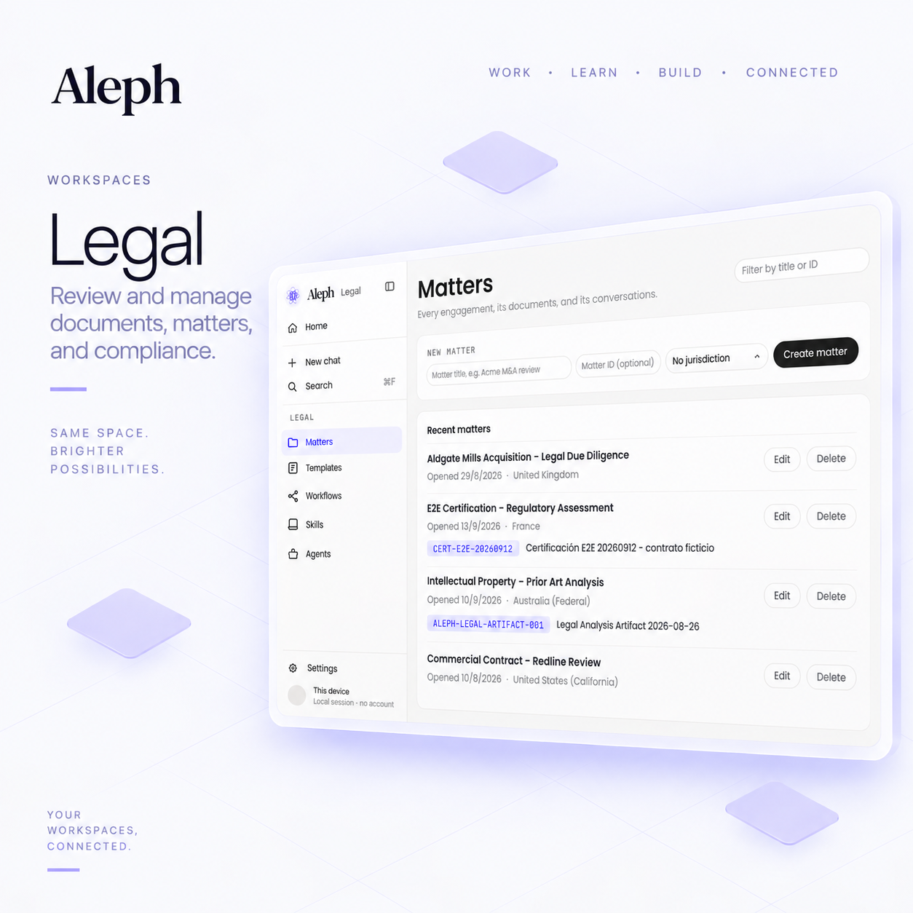
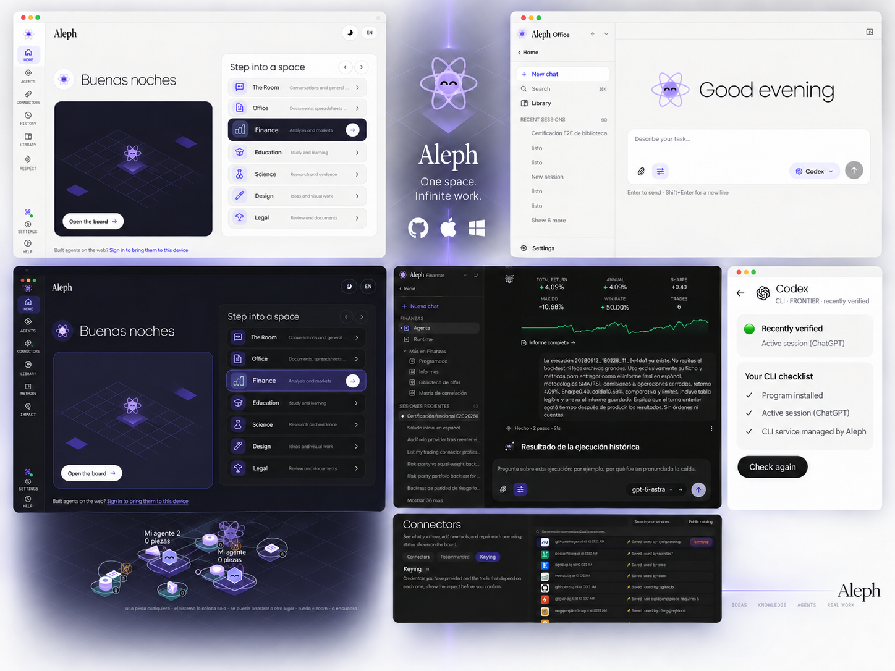

# Product Surfaces and Media Index

This directory maps curated repository images to product concepts. It is intended for maintainers editing README/docs, not as a marketing asset dump.

## Canonical/current images

### The Workshop

`assets/hero/workshop-dark.png`

Use for The Workshop/composition architecture.

### Science

`assets/hero/science-dark.png`

Use for artifact-rich workspace examples.

### Workspaces map

`assets/overview/workspaces-map.png`

Use when explaining the six-workspace product model.

### Models and CLI

`assets/overview/models-and-cli.png`

Use when documenting provider and CLI integration concepts. Do not treat every visible logo as a guarantee of release availability.

### Connectors

`assets/overview/connect-tools.png`

Use for connector/integration architecture.

### Finance

`assets/workspaces/finance-light.png`

### Legal

`assets/workspaces/legal-light.png`

### Product overview collage

`assets/overview/product-collage.png`

Useful for internal release notes or broader product overview sections.

## Legacy naming references

The following images contain the older label **The Room** and should not be used to establish current naming:

- `assets/reference/legacy/home-light-room-label.png`
- `assets/reference/legacy/home-angled-room-label.png`

They are retained as historical UI references only. Current documentation should say **The Workshop**.
